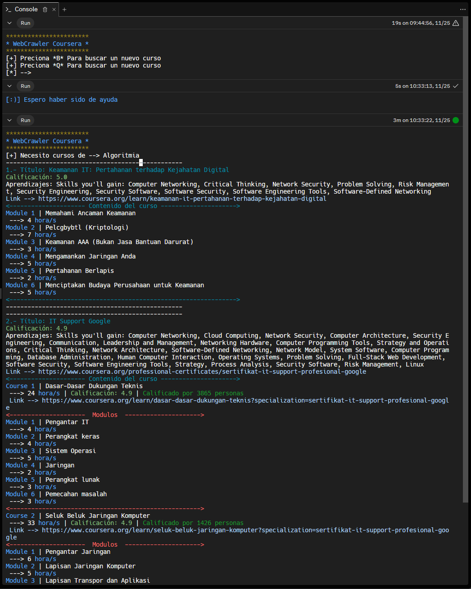
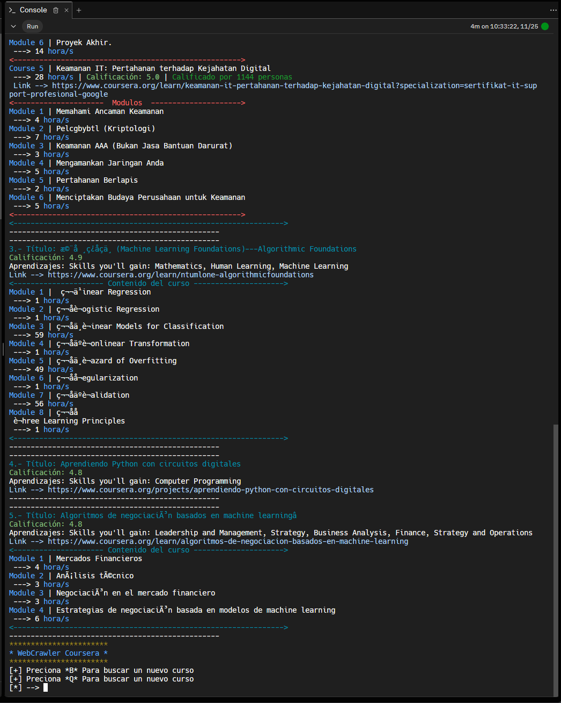

# WebCrawler

Extrae los cinco cursos mejores calificados, junto a los módulos que los componen, calificación y el tiempo aproximado para completarlos.

### Ejecución
* Instalar librerias con:
```bash
pip install -r requirements.txt
```

* Para ejecutar el programa:

```bash
python3 crawler.py
```

### Screenshots



